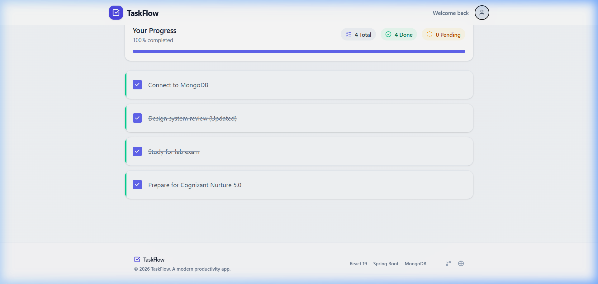
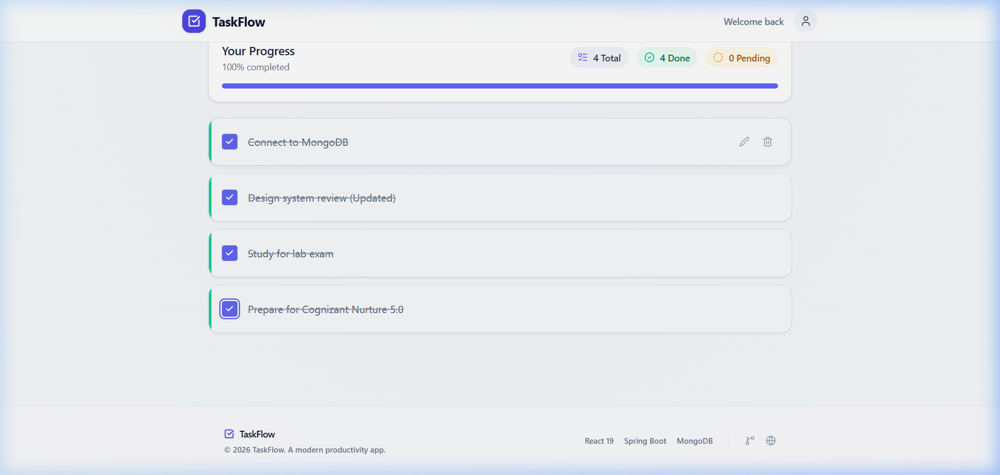

<div align="center">
  
  
  

  <h1>TaskFlow — Full Stack Productivity Application</h1>

  <p>
    A modern, fully responsive CRUD application built with <strong>Java Spring Boot</strong>, <strong>React</strong>, and <strong>MongoDB</strong>. 
  </p>

  <p>
    <a href="#features">Features</a> • 
    <a href="#tech-stack">Tech Stack</a> • 
    <a href="#screenshots">Screenshots</a> • 
    <a href="#getting-started">Getting Started</a> • 
    <a href="#api-reference">API Reference</a>
  </p>

  <p>
    
    
    
    
  </p>
</div>

---

## 📖 Overview

TaskFlow is a robust task management platform demonstrating end-to-end full-stack development best practices. It features a scalable RESTful API built with Java and Spring Boot, connected to a NoSQL MongoDB database. The frontend is a snappy, modern single-page application (SPA) built with React and styled with a custom responsive design system.

This project was developed to showcase practical application of Java Full Stack development concepts, including frontend-backend integration, robust API design, and modern UI/UX principles.

## ✨ Key Features

- **Complete CRUD Operations:** Create, Read, Update, and Delete tasks efficiently.
- **RESTful API:** Structured and predictable endpoints adhering to REST principles.
- **Responsive UI:** Seamless experience across desktop, tablet, and mobile devices.
- **Dynamic Theming:** Built-in Light and Dark mode support for enhanced accessibility.
- **Real-time State Management:** Immediate UI updates upon API success.
- **Error Handling & Load States:** Graceful degradation and user feedback during network operations.

## 🛠️ Tech Stack

### Backend
- **Java 17:** Core programming language.
- **Spring Boot 3.x:** Rapid application development framework.
- **Spring Web:** For building RESTful, web-based applications.
- **Spring Data MongoDB:** Seamless integration with MongoDB.
- **Maven:** Dependency management and build lifecycle.

### Frontend
- **React.js:** Component-based UI library.
- **Vite:** Next-generation, lightning-fast frontend tooling.
- **Axios:** Promise-based HTTP client for the browser.
- **Vanilla CSS3:** Custom, utility-driven styling (Flexbox/Grid).

### Database
- **MongoDB Atlas:** Cloud-hosted NoSQL database service.

## 📸 Screenshots

<div align="center">

| 🌙 Dark Mode | ☀️ Light Mode |
|:---:|:---:|
|  |  |

</div>

## 🚀 Getting Started

Follow these steps to run the project locally on your machine.

### Prerequisites

Ensure you have the following installed:
- [Java Development Kit (JDK) 17+](https://adoptium.net/)
- [Node.js (v18+) and npm](https://nodejs.org/)
- [Git](https://git-scm.com/)
- A free [MongoDB Atlas](https://cloud.mongodb.com/) account (or local MongoDB server)

### 1. Clone the Repository

```bash
git clone https://github.com/eldhoaby/TaskFlow.git
cd TaskFlow
```

### 2. Configure the Backend (Spring Boot)

1. Open `backend/src/main/resources/application.properties`.
2. Update the `spring.data.mongodb.uri` with your MongoDB connection string.

```properties
spring.data.mongodb.uri=mongodb+srv://<username>:<password>@<cluster>.mongodb.net/taskflow?retryWrites=true&w=majority
server.port=8080
```

3. Run the backend application:

```bash
cd backend
./mvnw spring-boot:run     # On Mac/Linux
# OR
.\mvnw.cmd spring-boot:run # On Windows
```
*The backend server will start on `http://localhost:8080`.*

### 3. Configure the Frontend (React)

Open a new terminal window and navigate to the frontend directory:

```bash
cd frontend
npm install
npm run dev
```
*The React application will start on `http://localhost:5173` (or port specified by Vite).*

## 📡 API Reference

The backend exposes a standard REST API. 

| HTTP Method | Endpoint | Description | Request Body Example |
| :--- | :--- | :--- | :--- |
| `GET` | `/api/tasks` | Fetch all tasks | *None* |
| `POST` | `/api/tasks` | Create a new task | `{ "title": "Buy groceries" }` |
| `PUT` | `/api/tasks/{id}` | Update an existing task | `{ "title": "Buy groceries", "completed": true }` |
| `DELETE` | `/api/tasks/{id}` | Delete a task | *None* |

## 🎯 Learning Outcomes

Building this project reinforced several critical full-stack concepts:
- **Architecture:** Understanding the clear separation of concerns between a React frontend and a Spring Boot backend.
- **CORS Configuration:** Safely enabling cross-origin requests from the React dev server to the Spring API.
- **Asynchronous JavaScript:** Handling promises and asynchronous data fetching with Axios and React hooks (`useEffect`, `useState`).
- **Database Modeling:** Designing document-based data structures in MongoDB.

## 📄 License

This project is open-source and licensed under the [MIT License](LICENSE).

---
<p align="center">
  <b>Built with passion by <a href="https://github.com/eldhoaby">Eldhoaby</a></b><br/>
  <i>Java Full Stack Application</i>
</p>
